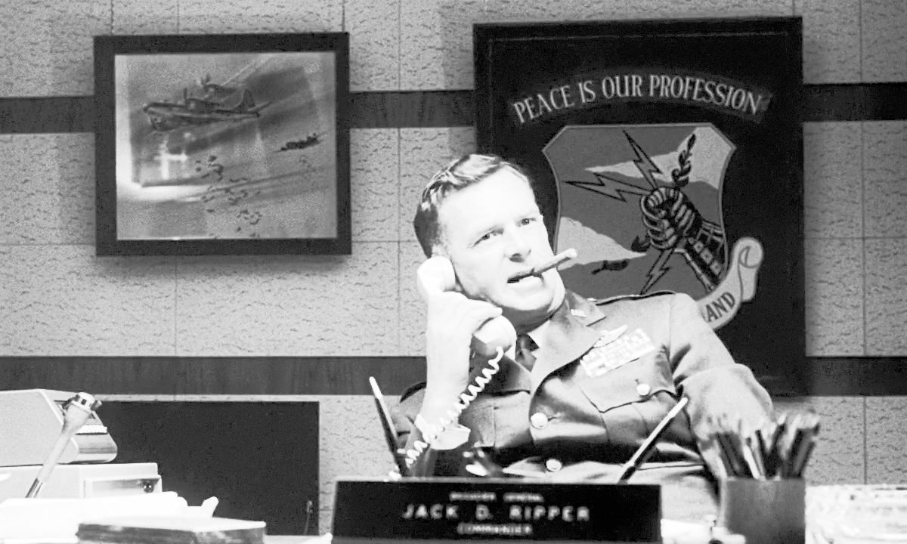

## EqualizeHist

[Histogram Equalization](https://en.wikipedia.org/wiki/Histogram_equalization) for Vapoursynth.

### Usage
```python
ehist.EqualizeHist(vnode clip)
```
### Parameters:

- clip\
    A clip to process. 8-16 bit integer only.

## CLAHE

[Contrast Limited Adaptive Histogram Equalization](https://docs.opencv.org/5.x/d5/daf/tutorial_py_histogram_equalization.html) for Vapoursynth.\
This filter uses OpenCV internally because I don't know how to do tiles in VS (please send help).

### Usage
```python
ehist.CLAHE(vnode clip[, float limit=7, int tile=3])
```
### Parameters:

- clip\
    A clip to process. 8-16 bit integer only.
- limit\
    Threshold for contrast limiting.\
    For the 16 bit clip to have the same result as the 8 bit clip you have to multiply the limit by 256.
- tile\
    Tile size for histogram equalization.

## Example

### Luma 16 bit


### EqualizeHist 16 bit


### CLAHE(limit=15.0, tile=3) 16 bit
